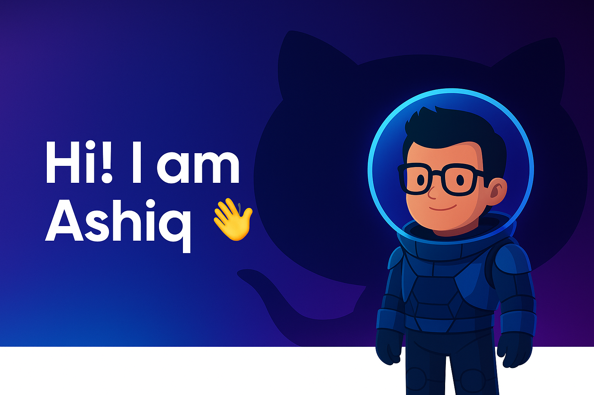

<!-- Profile Banner -->

  

<!-- Typing animation -->

  

<!-- 🌐 Social Icons - Custom SVGs with floating & rounded styling -->

  
  
  
  

---

<h2> 𝐇𝐞𝐥𝐥𝐨 𝐭𝐡𝐞𝐫𝐞, 𝐟𝐞𝐥𝐥𝐨𝐰 <𝚌𝚘𝚍𝚎𝚛𝚜/>! </h2>

I'm **Ashiq**, a software engineer, currently based in Berlin.

- 🧑‍🏫 Building Browser Extensions and Scalable Systems @ [mycashbacks GmbH](https://mycashbacks.com)
- ✍️ Currently exploring Distributed Systems and Robotics
- 🎓 Taught Data Science and Mobile Application Development with React Native @ [UIU](https://www.uiu.ac.bd/) 
- 🧠 Check my publications in [Google Scholar](https://scholar.google.com/citations?user=ujAbMnwAAAAJ&hl=en)  
- 💬 Let's Talk about oppurtunities and problems to solve.

---

### 🧩 Featured Works

| 🌟 Title | 📝 Description | 🔗 | 
|-----------|----------------|----|
| **M.I.D.A.S** | Mask Identification Door Access System | [GitHub](https://github.com/XLR8-07/Mask_detection_ESP32CAM) |
| **FracAtlas** | Bone Fracture localization using YOLO | [GitHub](https://github.com/XLR8-07/FracAtlas) [PapersWithCode](https://paperswithcode.com/dataset/fracatlas) |
| **MosquitoFusion** | Dataset for Real-Time Detection of Mosquitoes | [GitHub](https://github.com/faiyazabdullah/MosquitoMiner) [ICLR Paper](https://openreview.net/pdf?id=3s4hFx8pYs)|

---

### ⚙️ Tech Stack

  

---

### 📊 GitHub Stats

<!--  -->

---

### 💬 Let’s Collaborate

I'm always up for collaborations in education, AI, and full-stack innovation.

> *"Let us cultivate our garden."* – Voltaire 🌱  
📬 `joyashikur@gmail.com` | [ashiq.info](https://ashiq.info)

---
